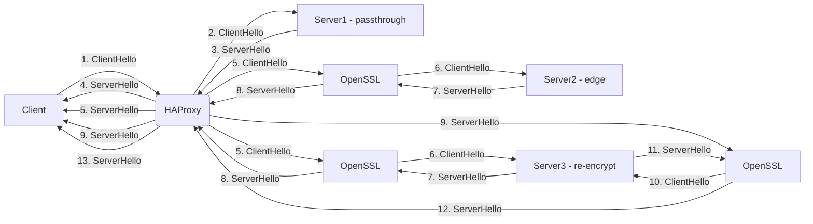
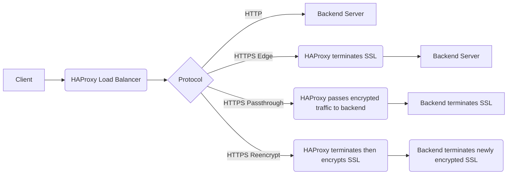
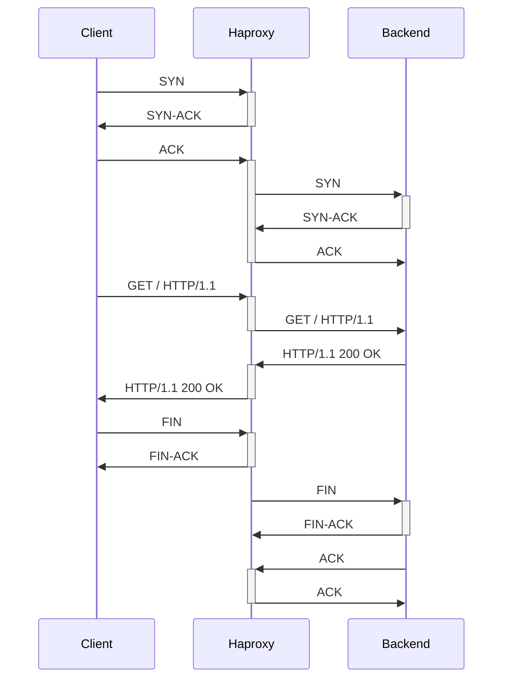

```mermaid
graph LR
    subgraph Client
        A[Start Connection]
    end

    subgraph Load Balancer
        B[Receive Connection]
        C[Decrypt TLS]
        D[Load Balance]
        E[Encrypt TLS]
    end

    subgraph Backend
        F[Receive Connection]
    end

    subgraph Client -> Load Balancer
        A --> B
        B --> C
        C --> D
        D --> E
    end

    subgraph Load Balancer -> Backend
        E --> F
    end
```






===============




```mermaid
sequenceDiagram
  participant Client
  participant HAProxy
  participant Backend

  Client->>+HAProxy: Send GET request
  Note over HAProxy: Terminate TLS\nand decrypt request
  HAProxy->>+Backend: Forward decrypted request
  Backend-->>-HAProxy: Send response
  Note over HAProxy: Encrypt response\nand create TLS tunnel
  HAProxy-->>-Client: Forward encrypted response
  ```

```mermaid
sequenceDiagram
  participant Client
  participant HAProxy1
  participant HAProxy2
  participant Backend

  Client->>+HAProxy1: Send GET request
  Note over HAProxy1: Terminate TLS\nand decrypt request
  HAProxy1->>+Backend: Forward decrypted request
  Backend-->>-HAProxy1: Send response
  Note over HAProxy1: Encrypt response\nand create TLS tunnel to HAProxy2
  HAProxy1->>+HAProxy2: Forward TLS tunnel
  Note over HAProxy2: Decrypt tunnel\nand re-encrypt using own certificate
  HAProxy2-->>-HAProxy1: Forward re-encrypted tunnel
  Note over HAProxy1: Forward encrypted response\nto Client
  HAProxy1-->>-Client: Forward encrypted response
```
