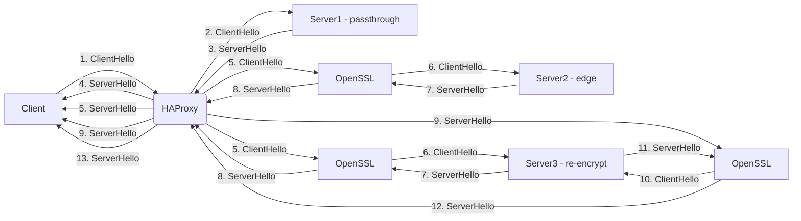
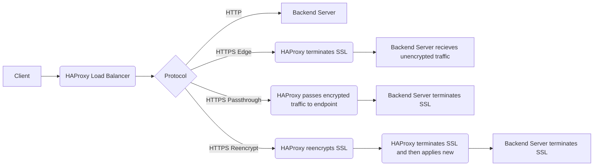

```mermaid
graph LR
    subgraph Client
        A[Start Connection]
    end

    subgraph Load Balancer
        B[Receive Connection]
        C[Decrypt TLS]
        D[Load Balance]
        E[Encrypt TLS]
    end

    subgraph Backend
        F[Receive Connection]
    end

    subgraph Client -> Load Balancer
        A --> B
        B --> C
        C --> D
        D --> E
    end

    subgraph Load Balancer -> Backend
        E --> F
    end
```




