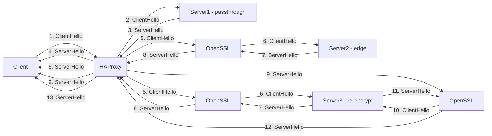
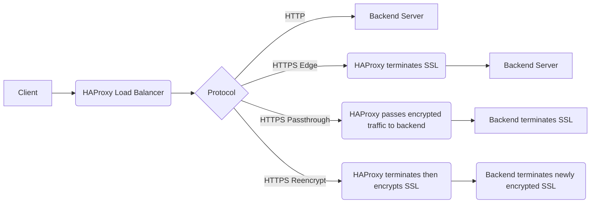
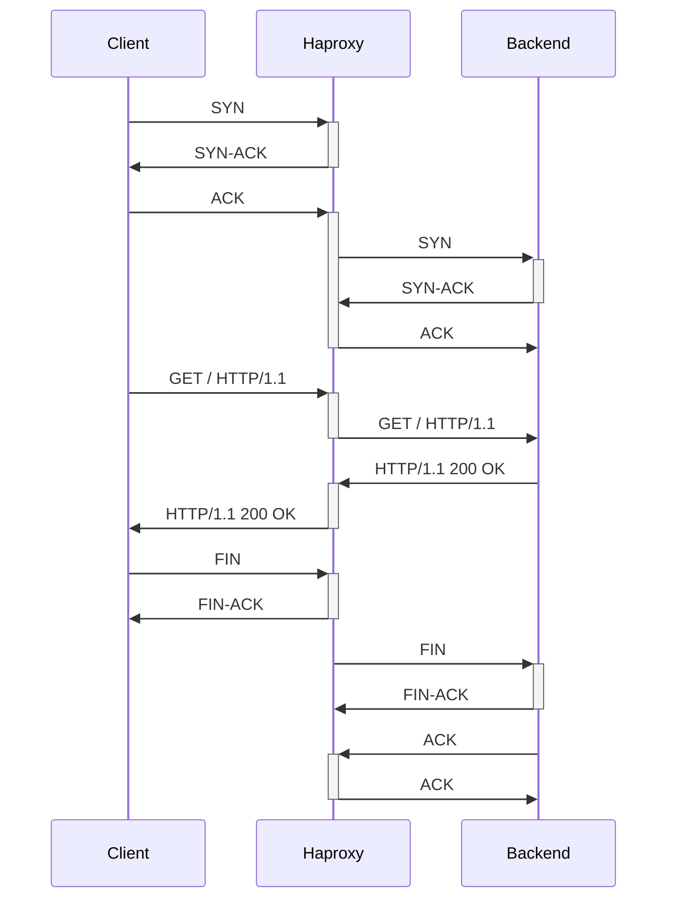
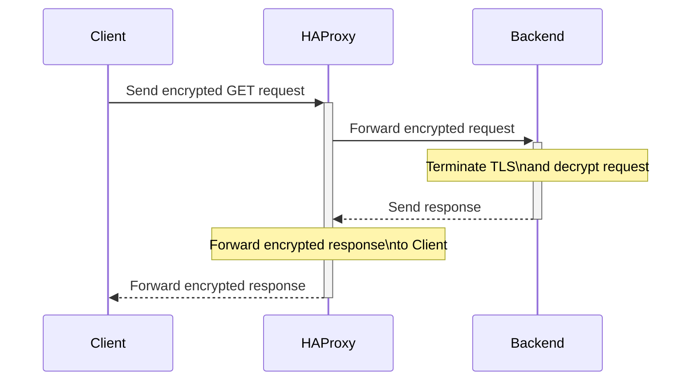

```mermaid
graph LR
    subgraph Client
        A[Start Connection]
    end

    subgraph Load Balancer
        B[Receive Connection]
        C[Decrypt TLS]
        D[Load Balance]
        E[Encrypt TLS]
    end

    subgraph Backend
        F[Receive Connection]
    end

    subgraph Client -> Load Balancer
        A --> B
        B --> C
        C --> D
        D --> E
    end

    subgraph Load Balancer -> Backend
        E --> F
    end
```






===============

# connection lifecycle on unencryped route:


# edge encrypted:
```mermaid
sequenceDiagram
  participant Client
  participant HAProxy
  participant Backend

  Client->>+HAProxy: Send GET request
  Note over HAProxy: Terminate TLS\nand decrypt request
  HAProxy->>+Backend: Forward decrypted request
  Backend-->>-HAProxy: Send response
  Note over HAProxy: Encrypt response\nand create TLS tunnel
  HAProxy-->>-Client: Forward encrypted response
  ```

# re-encrypted
```mermaid
sequenceDiagram
  participant Client
  participant HAProxy
  participant Backend

  Client->>+HAProxy: Send encrypted GET request
  Note over HAProxy: Decrypt request\nand re-encrypt using own certificate
  HAProxy->>+Backend: Forward re-encrypted request
  Note over Backend: Terminate TLS\nand decrypt request
  Backend->>+HAProxy: Forward decrypted request
  Note over HAProxy: Encrypt response\nand create TLS tunnel to Client
  HAProxy-->>-Backend: Forward encrypted response
  Note over Backend: Encrypt response\nand create TLS tunnel to HAProxy
  Backend-->>-HAProxy: Forward encrypted response
  Note over HAProxy: Forward re-encrypted response\nto Client
  HAProxy-->>-Client: Forward re-encrypted response

```
# passthrough



================

# sharding

```mermaid
graph LR
  subgraph sharded ingress controller
    shardedRoutes{{routes labeled 'sharded=true', shard-apps.mycluster.mydomain}} --> shardedIC[sharded ingress controller]
    shardedIC --> D[routeD]
    shardedIC --> E[routeE]
    shardedIC --> F[routeF]
    D --> G[pod1]
    D --> H[pod2]
    D --> I[pod3]
    E --> J[pod4]
    F --> K[pod5]
    F --> L[pod5]
  end
  
  subgraph default ingress controller
    unlabeledRoutes{{routes not labeled 'sharded=true', apps.mycluster.mydomain}} --> defaultIC[default ingress controller]
    defaultIC --> A[routeA]
    defaultIC --> B[routeB]
    defaultIC --> C[routeC]
    A --> M[pod6]
    A --> N[pod7]
    B --> O[pod8]
    C --> P[pod9]
    C --> Q[pod10]
    C --> R[pod11]
  end
  
  client[client http/https request] --> unlabeledRoutes
  client[client http/https request] --> unlabeledRoutes
  client[client http/https request] --> unlabeledRoutes
  client[client http/https request] --> shardedRoutes
  client[client http/https request] --> shardedRoutes
  client[client http/https request] --> shardedRoutes
```

